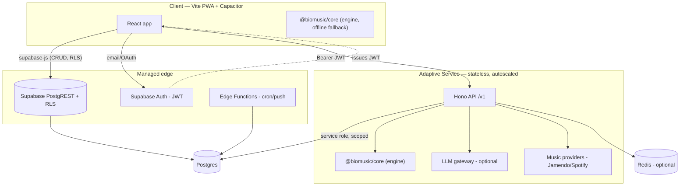
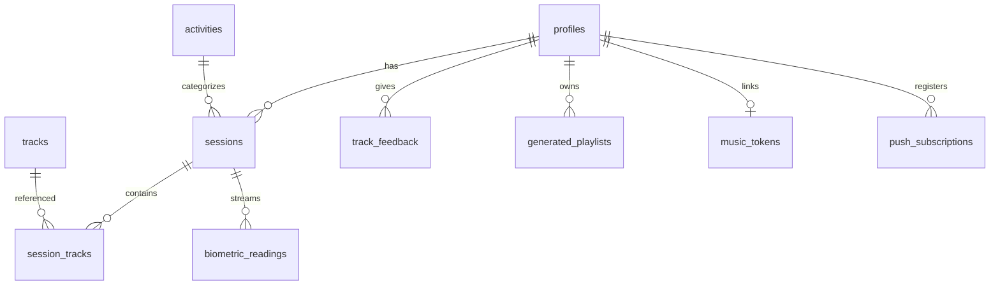
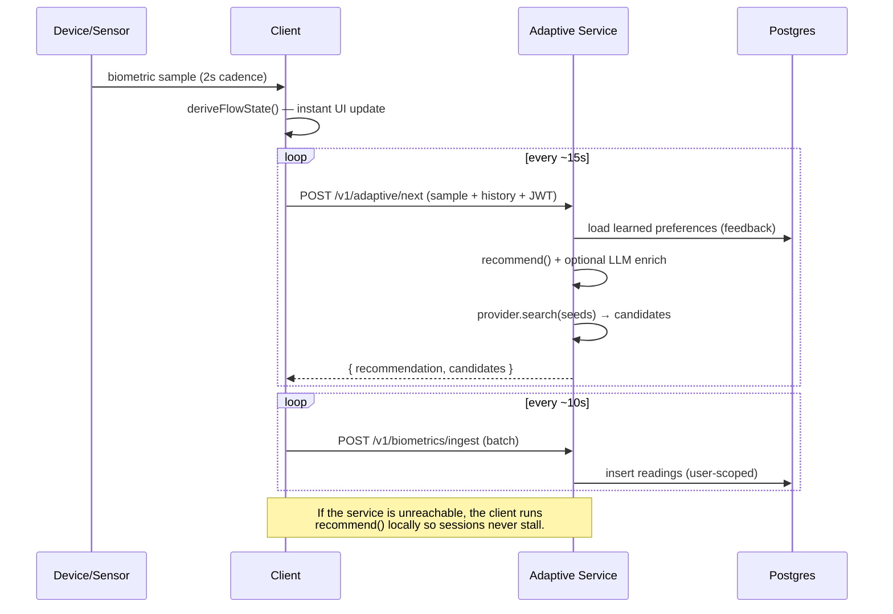

# BioMusic — System Architecture

BioMusic adapts a listener's soundtrack in real time using biometric signals
(heart rate, HRV, stress, focus, EEG) to steer them toward an optimal **flow
state** for a chosen activity (workout, study, sleep, relax, commute,
meditation).

This document describes the v2 redesign: a **hybrid architecture** that keeps
the simple 80% on managed infrastructure (Supabase) and isolates the heavy 20%
(adaptive ML/AI, provider integrations, high-throughput telemetry) in a
stateless service that scales horizontally.

---

## 1. Design principles

1. **Lean core, isolated heavy lifting.** CRUD that RLS can secure stays on
   Supabase and is called directly from the client. Compute- or secret-heavy
   work lives behind one stateless service.
2. **The engine is deterministic and portable.** The recommendation algorithm
   is a pure function in a shared package, so it runs identically in the browser
   (instant, offline) and on the server (where an LLM can enrich it). The AI is
   an enhancement, never a hard dependency.
3. **Every tier scales independently.** The client is static/CDN-served, the
   service is stateless behind a load balancer, Postgres is the only stateful
   component, and Redis is a drop-in for fleet-wide cache + rate limiting.
4. **Security at the boundary.** RLS scopes all direct table access to
   `auth.uid()`; the service verifies Supabase JWTs locally and scopes every
   service-role query to the caller.

---

## 2. Tiers



| Tier | Responsibility | Scaling |
|------|----------------|---------|
| **Client** (`/src`) | UI, live biometric capture, offline engine fallback | Static assets on CDN; infinite |
| **Supabase Auth** | Identity, JWT issuance, OAuth | Managed |
| **Supabase Postgres + RLS** | Source of truth for user data; direct CRUD from client | Read replicas; partition hot tables |
| **Edge Functions** | Thin async/cron jobs (weekly digest, push, VAPID) | Managed, per-invocation |
| **Adaptive Service** (`/services/adaptive`) | Recommendations, AI playlists, biometric ingest, provider proxy | Stateless → N replicas behind LB |
| **Redis** (optional) | Distributed cache + rate limiting | Managed |

**Why hybrid rather than all-in-one?** Real-time recommendation, LLM calls, and
provider API keys do not belong in the browser, and high-frequency biometric
writes shouldn't pressure the client's RLS path. But the bulk of the app (auth,
sessions, history, feedback, settings) is plain authorated CRUD that Supabase +
RLS already secures perfectly. Splitting along this seam keeps the codebase
small while letting the expensive path scale on its own.

---

## 3. Repository / file structure

A single npm-workspace monorepo. Shared domain logic is a package consumed by
both the client and the service, so the contract between them is enforced by the
type system.

```
music-routine/
├── package.json                # workspace root = the web app (@biomusic/web)
├── docs/ARCHITECTURE.md         # this document
├── packages/
│   └── core/                    # @biomusic/core — shared, pure, no deps but zod
│       └── src/
│           ├── types.ts             # domain types
│           ├── activity-targets.ts  # per-activity physiological/music envelopes
│           ├── flow.ts              # flow-state classification from signals
│           ├── trend.ts             # biometric trend analysis
│           ├── preferences.ts       # learn preferences from feedback
│           ├── adaptive-engine.ts   # the deterministic recommendation engine
│           ├── contracts.ts         # zod request/response schemas (the API wire format)
│           └── adaptive-engine.test.ts
├── services/
│   └── adaptive/                # @biomusic/adaptive — stateless Hono service
│       ├── Dockerfile
│       └── src/
│           ├── index.ts             # app wiring, middleware, error envelope
│           ├── env.ts               # validated config
│           ├── auth.ts              # Supabase JWT verification middleware
│           ├── rate-limit.ts        # per-user fixed-window limiter
│           ├── cache.ts             # cache abstraction (memory → Redis)
│           ├── supabase.ts          # service-role client
│           ├── repository.ts        # all DB access, always user-scoped
│           ├── llm.ts               # optional LLM enrichment + curation
│           ├── providers/           # MusicProvider interface + Jamendo + Spotify
│           └── routes/              # adaptive, playlists, biometrics, providers
├── supabase/
│   ├── migrations/20260528000000_init_v2.sql   # consolidated v2 schema
│   └── functions/               # weekly-digest, send-push-notification, ...
└── src/                         # the web app
    ├── app/                     # auth context, protected route, shell, router glue
    ├── lib/                     # env, supabase client, adaptive client, query client
    ├── features/                # vertical slices (api + hooks + components)
    │   ├── profile/  sessions/  biometrics/  adaptive/  feedback/  insights/
    ├── pages/                   # thin route components
    └── components/ui/           # shadcn/ui primitives
```

---

## 4. Data model

See `supabase/migrations/20260528000000_init_v2.sql` for the authoritative,
runnable schema. RLS is enabled on every user table with policies scoped to
`auth.uid()`.



| Table | Purpose | Notes |
|-------|---------|-------|
| `profiles` | 1:1 with `auth.users` | auto-created via trigger; holds onboarding + preferences |
| `activities` | display metadata for the 6 activities | engine targets live in code, not here |
| `tracks` | shared catalogue deduped by `(provider, provider_track_id)` | features on Spotify scale |
| `sessions` | a listening session | indexed by `(user_id, started_at)` and `(user_id, status)` |
| `session_tracks` | what played during a session | |
| `biometric_readings` | high-volume time-series telemetry | indexed for time-series reads; **first candidate for monthly partitioning** |
| `track_feedback` | thumbs up/down | feeds `derivePreferences()` |
| `generated_playlists` | AI/deterministic playlists | |
| `music_tokens`, `push_subscriptions` | provider tokens + web-push creds | **encrypted at rest** via pgcrypto triggers; decrypted only through `SECURITY DEFINER` accessors |

**Scaling the hot table.** `biometric_readings` grows fastest (one row every few
seconds per active session). The schema indexes it for the two real queries
(`by session, recent` and `by user, recent`). At volume, convert it to a
`PARTITION BY RANGE (recorded_at)` monthly-partitioned table and attach a
retention/rollup job — no application changes required because all access is via
the repository layer.

**Legacy → v2 mapping** (for existing deployments): `listening_sessions →
sessions`, `songs → tracks`, `session_songs → session_tracks`; biometric columns
renamed to `hrv`, `eeg_*`. Run the v2 schema on a fresh project and backfill.

---

## 5. API surface

### 5a. Direct (client → Supabase, RLS-enforced)
Plain CRUD via `supabase-js`, secured by row-level security:
`profiles`, `activities`, `sessions`, `session_tracks`, `track_feedback`,
`generated_playlists`.

### 5b. Adaptive service (`/services/adaptive`)
All `/v1` routes require a valid Supabase JWT (`Authorization: Bearer <token>`).
Request/response shapes are the zod schemas in `@biomusic/core/contracts`.

| Method | Path | Purpose | Limit |
|--------|------|---------|-------|
| `GET`  | `/health` | liveness + feature flags (no auth) | — |
| `POST` | `/v1/adaptive/next` | next recommendation + candidate tracks | 120/min |
| `POST` | `/v1/playlists/generate` | curated, persisted playlist for an activity | 20/min |
| `POST` | `/v1/biometrics/ingest` | batched biometric sample ingestion | 60/min |
| `GET`  | `/v1/providers/:provider/search` | unified catalogue search proxy | 90/min |

Errors use a consistent envelope: `{ "error": { "message", "status" } }`;
validation failures return `400` with zod `issues`.

### 5c. Async (Supabase Edge Functions)
`weekly-digest` (cron) and `send-push-notification` / `get-vapid-key` for web
push.

---

## 6. The adaptive loop



The engine (`recommend()`):
1. picks the activity's physiological/musical envelope (`activity-targets`),
2. derives flow state and trend from the sample + recent history,
3. chooses an action (raise/lower tempo or energy, hold, change genre) with
   hysteresis so it doesn't thrash,
4. computes concrete tempo/energy/valence targets, nudged toward the user's
   learned sweet spot,
5. emits feature **seeds** a provider turns into real candidate tracks.

---

## 7. UI architecture

- **Stack:** React 18 + Vite + TypeScript, Tailwind + shadcn/ui, React Router,
  TanStack Query, installable PWA (vite-plugin-pwa) wrapped by Capacitor for
  native iOS/Android.
- **Layering:** `pages/` are thin route shells → `features/<slice>/` own their
  data (`api.ts` + React Query `hooks.ts`) and UI → `lib/` holds the typed
  clients (`supabase`, `adaptive-client`), validated `env`, and the query
  client. Cross-cutting concerns (auth context, protected routes, app shell)
  live in `app/`.
- **State:** server state via TanStack Query (cached, deduped, centralised keys
  in `lib/query.ts`); live session state via the `useBiometrics` /
  `useAdaptiveSession` hooks; no global store needed.
- **Biometric sources** implement one `BiometricSource` interface
  (`features/biometrics/source.ts`): a working simulator (phone-only),
  Web-Bluetooth heart rate today, and Apple HealthKit / EEG adapters plug into
  the same seam.
- **Resilience:** route-level code splitting, an error boundary, and an offline
  recommendation fallback.

---

## 8. Scaling to millions

| Concern | Approach |
|---------|----------|
| Client delivery | Static build on CDN; PWA caching |
| Recommendation/AI load | Stateless service → autoscale replicas; LLM behind a timeout with deterministic fallback |
| Cache & rate limiting | Swap `cache.ts` memory impl for Redis → fleet-wide, no call-site changes |
| Biometric write volume | Client batches writes; partition `biometric_readings` by month + retention rollups |
| Read scale | Postgres read replicas; all reads RLS-scoped and indexed |
| Provider quotas | Server-side proxy with per-query caching keeps keys server-only and absorbs bursts |
| Cost control | LLM enrichment is opt-in per request; the deterministic engine carries the baseline |
| Secrets | RLS + pgcrypto-encrypted tokens; service role used only behind verified JWTs |
```
